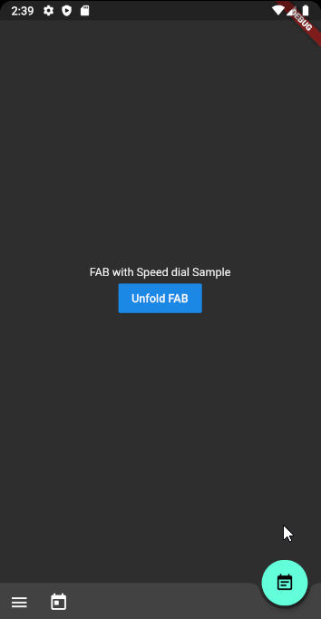

# Flutter Speed dial of Material Design style

Flutter package which applies Material design Speed dial

## Preview
There are several packages that provide fancy speed dial.
However, as most of those do not work properly on docked FAB using notch, I referenced Andrea Bizzoto and Matt Carroll's idea/code specified [here](https://medium.com/coding-with-flutter/flutter-bottomappbar-navigation-with-fab-8b962bb55013) to make it work fine with notch as well.
Truly appreciate to Andrea and Matt for sharing such an awesome idea and codes.



## Usage

### Basic usage
```dart
Widget build(BuildContext context) {
    return Scaffold(
      body: SafeArea(child: _buildBody()),
      floatingActionButton: _buildFloatingActionButton(),
      floatingActionButtonLocation: FloatingActionButtonLocation.endDocked,
      bottomNavigationBar: _buildBottomBar(),
    );
  }

Widget _buildFloatingActionButton() {
    final icons = [
      SpeedDialAction(child: Icon(Icons.mode_edit)),
      SpeedDialAction(child: Icon(Icons.date_range)),
      SpeedDialAction(child: Icon(Icons.list)),
    ];

    return SpeedDialFloatingActionButton(
      actions: icons,
      // Make sure one of child widget has Key value to have fade transition if widgets are same type.
      childOnFold: Icon(Icons.event_note, Key: UniqueKey()),
      childOnUnfold: Icon(Icons.add),
      useRotateAnimation: true,
      onAction: _onSpeedDialAction,
    );
  }
  
_onSpeedDialAction(int selectedActionIndex) {
  print('$selectedActionIndex Selected');
}
```

### Using controller
```dart
SpeedDialController _controller = SpeedDialController();

SpeedDialFloatingActionButton(
      controller: _controller,
      ...
    );
    
// Use anywhere to mannually unfold
_controller.unfold();
```

### Fade Transition animation between child widgets
In order to apply fade transition between [childOnFold] and [childOnUnfold], make sure one of those has Key field. (eg. ValueKey<int>(value) or UniqueKey()).
As we using AnimatedSwitcher for transition animation, no key with same type of child will perform no animation. It is AnimatedSwitcher's behaviour.
    
## TO-DOs
- [ ] Ability to display/hide speed dial when it is needed. (ex. hiding on scroll)
- [X] Unfold function to force close the dial
- [ ] Providing option for modal background with color parameter
- [ ] Text labels on each action widgets

## Contributing
Any pull requests for implementing To-Do functions are always welcome!

### Other useful packages you might be instrested
[Firebase Auth Simplify](https://pub.dev/packages/firebase_auth_simplify) 
[Google Maps Place Picker](https://pub.dev/packages/google_maps_place_picker)

## Support
If the package was useful or saved your time, please do not hesitate to buy me a cup of coffee! ;)  
The more caffeine I get, the more useful projects I can make in the future. 

<a href="https://www.buymeacoffee.com/Oj17EcZ" target="_blank"></a>
